# How It Works — C2 Framework Technical Overview

This document explains how the command-and-control framework operates — from the high-level architecture down to the ECDH key exchange, field-level database encryption, and certificate pinning. It covers both what happens when the framework runs and why specific design decisions were made.

Development was AI-assisted using Claude (Anthropic). Architecture decisions, security concepts, lab testing, and verification were done hands-on in a live environment.

---

## 1. Architecture

The framework follows the standard three-actor C2 model.

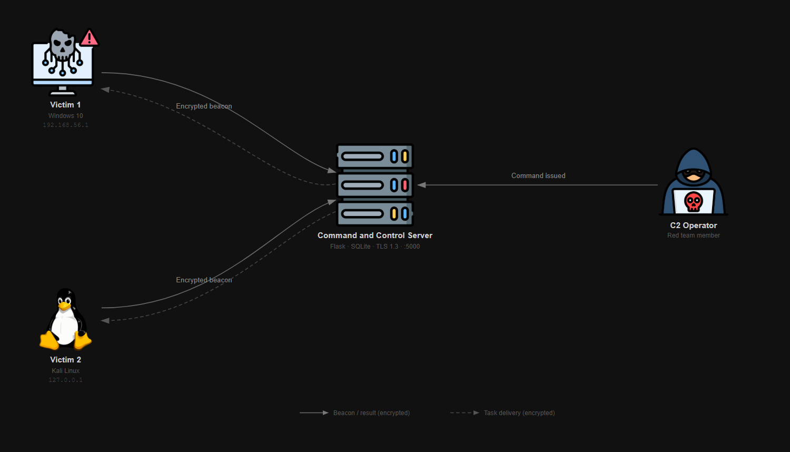

**Operator** — the red team member. Controls the campaign through a browser session. Never connects directly to agents — all tasking goes through the server.

**C2 Server** — a Flask application running on port 5000 over HTTPS (TLS 1.3). Manages a SQLite database of agents and tasks. Presents as a fake company website (NexaCloud) to any uninvited visitor.

**Agents** — Python scripts (`agent.py`) running on victim machines. They initiate all communication. The server never reaches out — agents beacon home on their own schedule.

The key design choice is **pull-based communication**. Agents poll the server; the server waits passively. From a network defender's perspective, the C2 server looks like an ordinary HTTPS web application receiving periodic browser-like requests. There is no outbound connection from the server to flag.

---

## 2. The C2 Profile — One Server, Three Responses

Every request that reaches the server is inspected before any content is served. The server checks HTTP headers and responds differently based on who is asking.

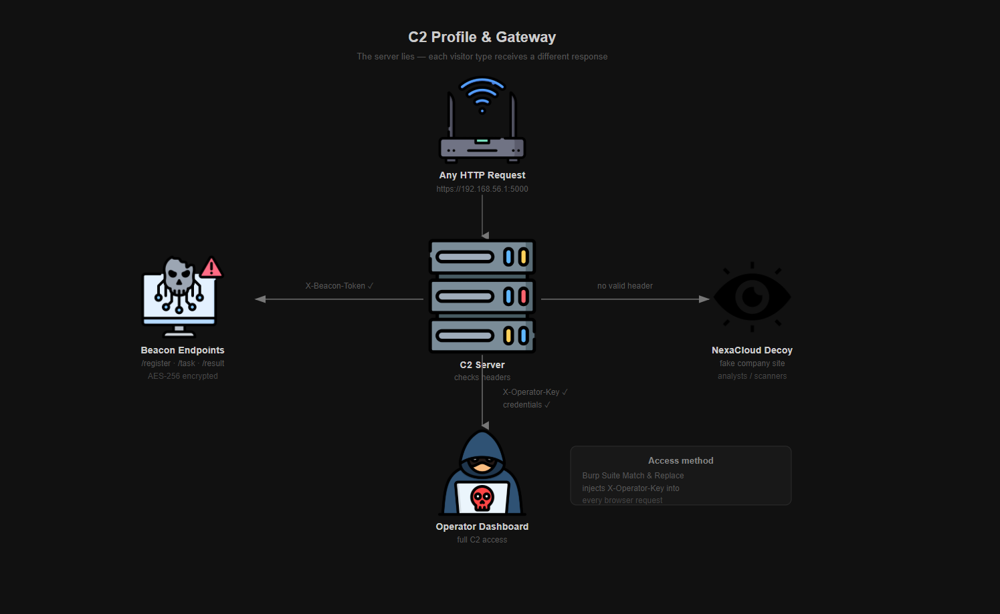

**If the request carries a valid `X-Beacon-Token` header** — it is an agent. The request is routed to the beacon endpoints. All payloads are AES-256 encrypted with a session-specific key.

**If the request carries a valid `X-Operator-Key` header** — it is the operator. The root `/` page silently redirects to `/login`. After credential verification, an 8-hour session is created and the operator is redirected to the dashboard.

**If neither header is present** — the visitor sees the NexaCloud decoy site. A convincing fake company page with products, pricing, and an about section. No indication of a C2 server.

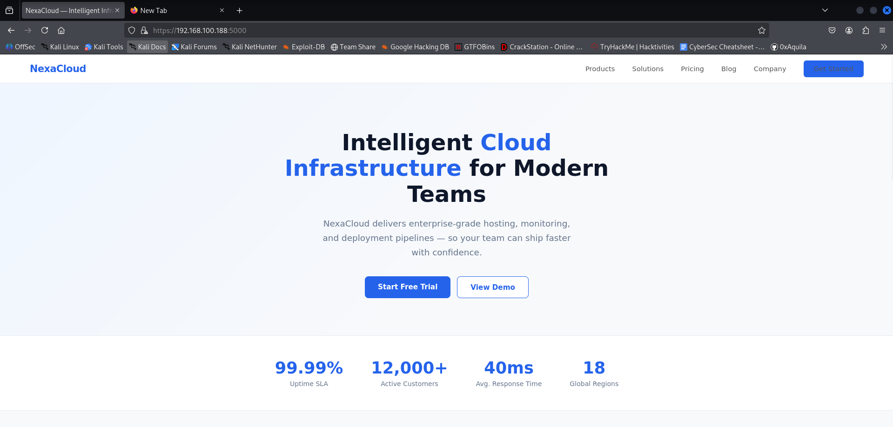

This design is borrowed from **Cobalt Strike's Malleable C2 profiles** — the principle that a C2 server should never reveal its purpose to uninvited visitors. Threat analysts, port scanners, and blue team investigators all walk away seeing a corporate website.

### Hidden login page

`/login` does not exist for uninvited visitors. Accessing it without the correct `X-Operator-Key` header returns a `404 Not Found` response — the same nginx-style error page that any missing URL would return. There is no login form to find, no redirect to follow, and no response difference that distinguishes `/login` from `/anything-else`. Scanner enumeration reveals nothing.

Even once authenticated, any operator request that arrives without the gateway header (expired proxy rule, wrong browser, session dropped) triggers a `404` rather than a redirect back to `/login`. This prevents an unauthenticated visitor from discovering that `/login` exists by observing an unusual redirect.

All other error conditions (403, 405, 500) also render the same nginx-style error template. Every error response is identical in structure; none expose Flask, Python, or any framework fingerprint. The `Server` header on every response is spoofed to `nginx/1.24.0`.

### Getting the operator header in

The `X-Operator-Key` header must be present on every browser request. Rather than adding it manually, a **Burp Suite Match & Replace** rule injects it automatically into every outgoing request through the proxy:

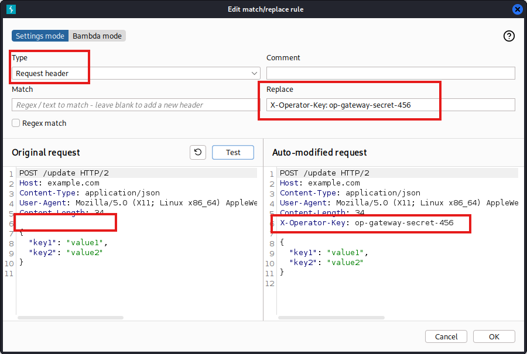

With the rule active, the browser behaves normally. Every request is silently upgraded with the gateway header before leaving the proxy, and the operator is never prompted about it again.

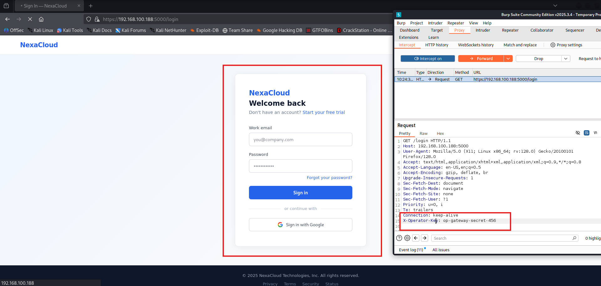

---

## 3. The Beacon Loop

Once an agent is running on a victim machine, it performs a one-time ECDH registration handshake and then enters a continuous polling cycle.

### Registration — ECDH Key Exchange

Before any operational beaconing begins, the agent and server establish a unique session key that neither side ever transmits in plaintext:

1. Agent generates a SECP256R1 (P-256) ECDH key pair in memory.
2. Agent POSTs its public key inside the registration payload, encrypted with the **bootstrap key** (the shared `ENCRYPTION_KEY` from config).
3. Server generates its own ECDH key pair, derives the shared secret using the agent's public key.
4. Both sides apply **HKDF-SHA256** to the shared secret with the label `c2-session-key` to produce a 32-byte AES session key.
5. Server returns its public key and a **per-agent session token** encrypted with the bootstrap key.
6. Agent derives the same session key from the server's public key and immediately switches to using it.

From this point, every message between this agent and the server uses the **session key** — a 256-bit AES key that was never transmitted and is unique to this session.

**Forward secrecy:** capturing and decrypting one agent's session reveals nothing about any other agent's session. When an agent re-registers (after a disconnect), a fresh ECDH exchange produces a new session key. Old traffic cannot be decrypted with the new key.

### The Polling Cycle

**Step 1 — Poll.** The agent sends `GET /beacon/task` every **30 ± 10 seconds**, using its session token in `X-Beacon-Token` and the session key for encryption. The ±10 second jitter is deliberate: consistent polling intervals are a known detection signature for next-generation firewalls and IDS rules.

**Step 2 — Execute.** If a task is waiting, the agent runs it locally on the victim OS and captures the output.

**Step 3 — Report.** The output is POSTed back to `/beacon/result`, encrypted with the session key. The task is marked `COMPLETED` in the database and the result immediately appears in the dashboard.

**Step 4 — Loop.** The agent sleeps for its jitter interval, then polls again.

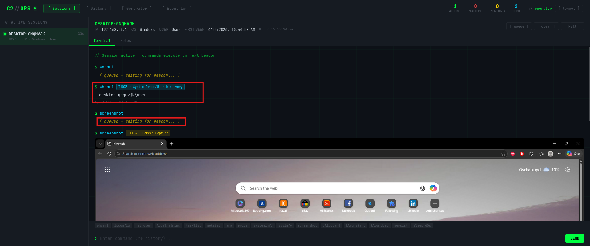

### Resilience

If the server goes offline mid-session, the agent sets `_registered = False` on the next failed beacon. On the subsequent cycle it re-enters the ECDH registration flow with a fresh key pair — it does not exit. The agent retries indefinitely with exponential backoff (5 s → 10 s → 20 s → 60 s, capped) until the server is reachable again. APT implants are built to survive server downtime. This agent mimics that.

---

## 4. Encryption

Communication is protected by three independent layers.

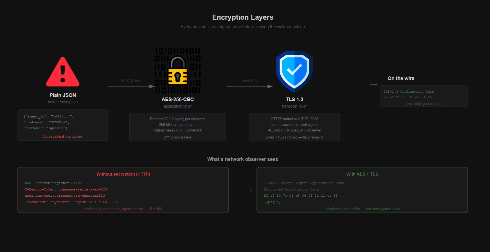

### Layer 1 — AES-256-CBC Session Encryption (application layer)

Before any HTTP request is made, the JSON payload is encrypted using **AES-256-CBC** with the HKDF-derived session key. A random 16-byte IV is generated per message, so the same command sent twice produces completely different ciphertext. This defeats replay attacks and pattern analysis.

Format: `base64( IV[16 bytes] + AES-256-CBC( PKCS7(JSON) ) )` — travels as the HTTP request body.

### Layer 2 — TLS 1.3 (transport layer)

The entire HTTPS connection is wrapped in TLS 1.3. A self-signed certificate (CN: `nexacloud.io`) was generated for the server and covers `localhost`, `nexacloud.io`, `127.0.0.1`, and the lab server IP as Subject Alternative Names. Valid for 825 days.

The practical result: **even if TLS is stripped by an intercepting proxy, the AES layer remains**. The payload is still locked without the session key.

### Layer 3 — Certificate Pinning

Agents with `verify=False` accept any TLS certificate, making them theoretically susceptible to MITM. Certificate pinning fixes this:

1. `gen_cert.py` computes the SHA-256 fingerprint of the generated certificate and writes it to `cert_fingerprint.txt`.
2. Generated agents have this fingerprint embedded at build time.
3. On startup, before any beacon, the agent connects to the server and compares the presented certificate's SHA-256 against the pinned value.
4. If they don't match — a MITM proxy has inserted its own certificate — the agent exits silently. No traffic is sent.

If the fingerprint field contains the placeholder value (`REPLACE_WITH_gen_cert_OUTPUT`), pinning is disabled — useful for development and testing.

### Wireshark — before and after

**Without encryption (HTTP)** — credentials, commands, and agent identity all visible:

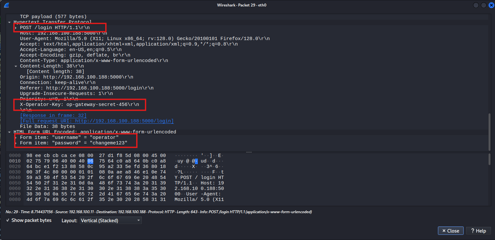

**With TLS + AES** — zero readable content:

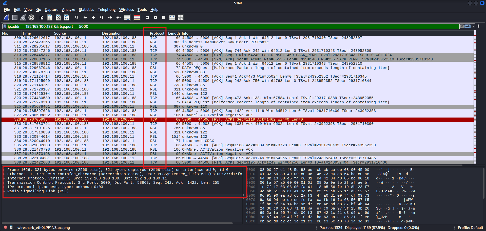

The certificate was generated using Python's `cryptography` library:

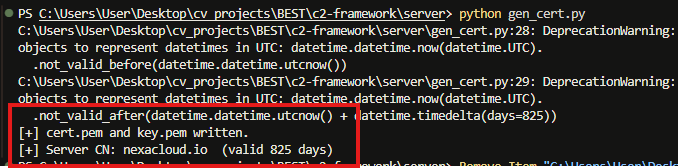

### Database Encryption at Rest

Sensitive fields in the SQLite database are encrypted at the column level using a custom SQLAlchemy `TypeDecorator` (`EncryptedText`). The following columns are never stored in plaintext:

- `Agent.hostname`, `Agent.ip`, `Agent.username`
- `Task.command`
- `Result.output` (includes screenshots and file data)

Encryption uses AES-256-CBC with a random IV per field value, using a **separate** `DB_ENCRYPTION_KEY` that is independent from the beacon encryption key. If the server is seized and the database file extracted, the contents are opaque ciphertext. Decryption requires the key, which is loaded from environment variables only — never from the codebase.

---

## 5. Agent Lifecycle

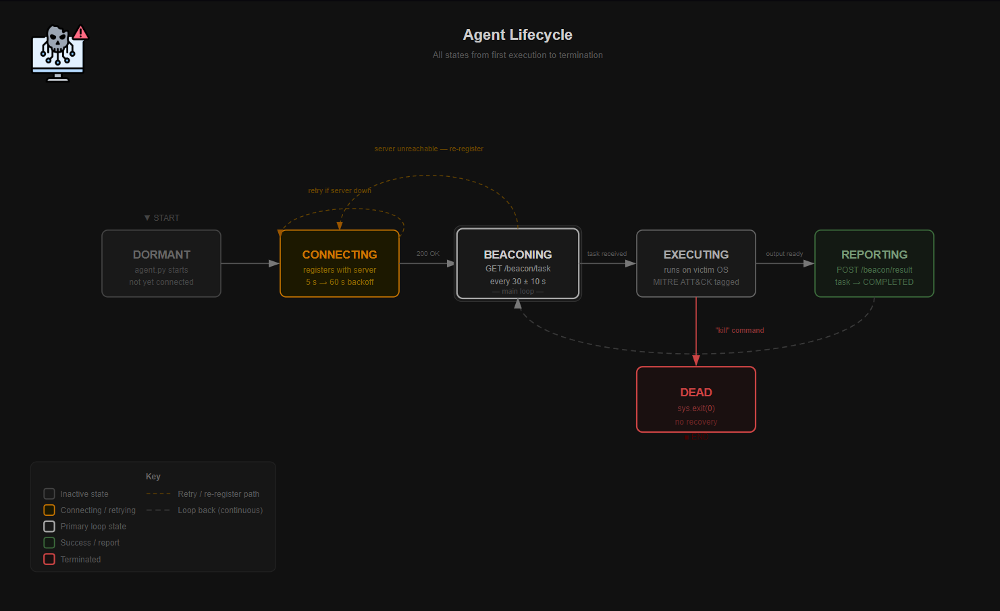

The agent moves through distinct states. Key design properties:

**Random identity** — on first run, the agent generates a random UUID (via `uuid.uuid4()`) and persists it to a hidden file (`.wdhlp` in `APPDATA`/`HOME`). Subsequent runs read from this file. The MAC address is never used — hardware fingerprints stay on the machine.

**Resilience** — the agent never exits on connection failure. If the server is unreachable, it retries with exponential backoff. If the session drops mid-operation, it re-registers with a fresh ECDH exchange on the next cycle.

**Per-agent session token** — after ECDH registration, the server issues a unique 64-char hex bearer token to each agent. This token replaces the global `API_KEY` for all subsequent beacon requests. If one agent is captured and analysed, only that agent's session is burned — the shared bootstrap key and all other agents are unaffected.

**Persistence (Windows)** — the `persist add` command writes the agent path to `HKCU\Software\Microsoft\Windows\CurrentVersion\Run` under the name `WindowsDefenderHelper`. The agent re-launches on every user login and survives full system reboots without further operator action.

**Termination** — the `kill` command triggers `sys.exit(0)`. There is no recovery from this state.

---

## 6. Dashboard

The operator dashboard is the central interface for running the campaign.

### Network Map

A live canvas-based visualisation of all connected agents. Each node shows the hostname, IP, and OS. Active agents pulse; inactive agents are dimmed.

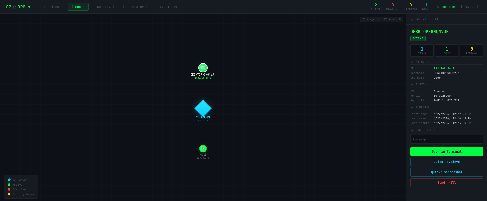

### Screenshot Capture

The `screenshot` command instructs the agent to capture the victim's current screen using Python Pillow (`ImageGrab`). The image is base64-encoded and transmitted over the encrypted beacon channel. The screenshot gallery tab displays all captured images:

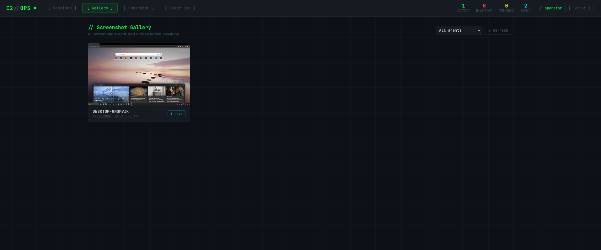

### Event Log

Every registration, task dispatch, and result is logged with a timestamp and the associated **MITRE ATT&CK technique tag**, making the simulated attack chain fully auditable:

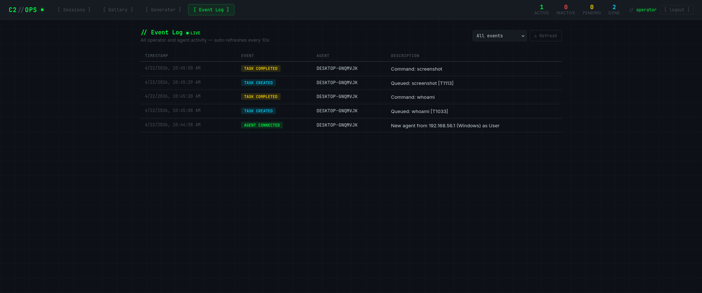

### Payload Generator

The generator tab produces hardened agent scripts pre-configured to connect back to the active server. The cert fingerprint is embedded automatically. Dropper scripts in six formats (PowerShell, Python, Bash, VBScript, VBA macro) are also available for delivery:

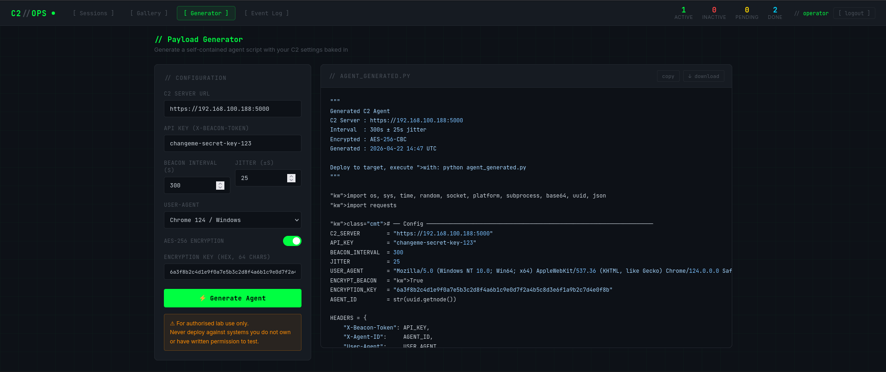

---

## 7. Network Layout

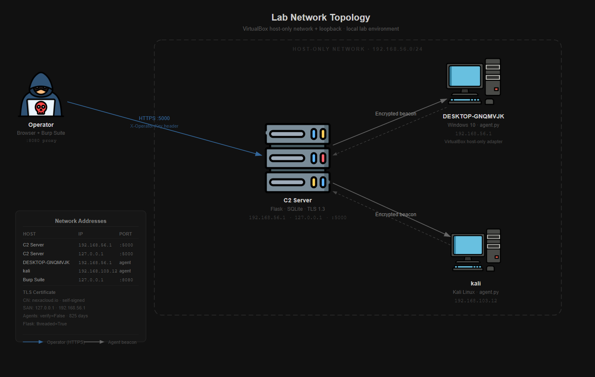

The lab runs two victim agents against one server:

| Host | OS | IP | Role |
|---|---|---|---|
| C2 Server | Kali Linux | `192.168.56.1` / `127.0.0.1` | Flask · SQLite · :5000 |
| DESKTOP-GNQMVJK | Windows 10 | `192.168.56.1` | Agent via VirtualBox host-only adapter |
| kali (agent) | Kali Linux | `127.0.0.1` | Agent via loopback (same machine as server) |

Both agents connect to the same Flask server on `:5000` over HTTPS. Flask runs with `threaded=True` to handle concurrent beacon requests from multiple agents without one blocking the other. This was a real bug encountered during testing — a single-threaded server caused the second agent to hang until the first beacon cycle completed.

The C2 server has two effective IP addresses: the host-only adapter address (`192.168.56.1`) and the loopback (`127.0.0.1`). Both are covered by the TLS certificate's Subject Alternative Names.

---

## Summary

| Component | Technology | Purpose |
|---|---|---|
| Server | Flask · SQLite · TLS 1.3 | Receives beacons, stores tasks and results |
| Key exchange | ECDH SECP256R1 + HKDF-SHA256 | Per-session forward-secret AES key |
| Payload encryption | AES-256-CBC + random IV | Application-layer encryption |
| Transport | TLS 1.3 · self-signed cert | Transport-layer encryption |
| Cert pinning | SHA-256 fingerprint | MITM prevention |
| DB at rest | AES-256-CBC EncryptedText | Field-level SQLite encryption |
| Agent auth | Per-agent session tokens | Burn one agent → others unaffected |
| Operator auth | Burp Suite · X-Operator-Key · session | Gateway header + 8-hour sessions |
| Agent identity | Random UUID · hidden file | No MAC address fingerprint |
| Persistence | Windows registry Run key | Survives reboot, disguised name |
| Rate limiting | Flask-Limiter · 404 on breach | Token brute-force protection |
| Secrets | Environment variables only | No hardcoded fallbacks anywhere |
